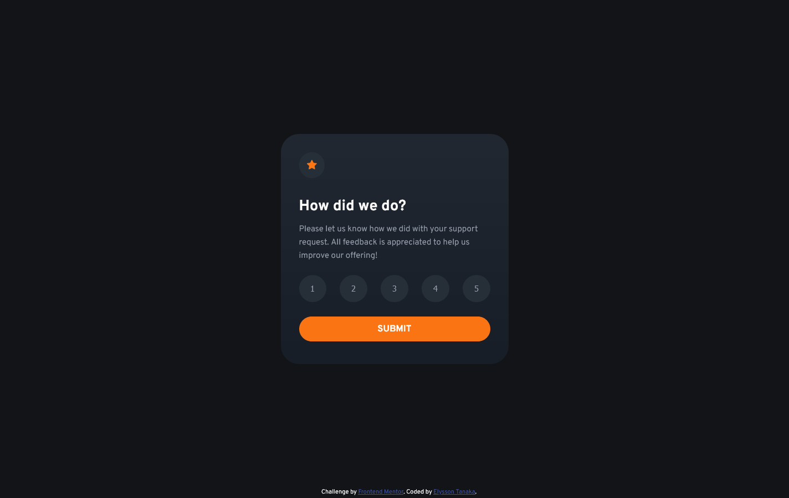

# Frontend Mentor - Interactive rating component solution

This is a solution to the [Interactive rating component challenge on Frontend Mentor](https://www.frontendmentor.io/challenges/interactive-rating-component-koxpeBUmI).

## Table of contents

- [Overview](#overview)
  - [The challenge](#the-challenge)
  - [Screenshot](#screenshot)
  - [Links](#links)
- [My process](#my-process)
  - [Built with](#built-with)
  - [What I learned](#what-i-learned)
- [Author](#author)

## Overview

### The challenge

Users should be able to:

- View the optimal layout for the app depending on their device's screen size
- See hover states for all interactive elements on the page
- Select and submit a number rating
- See the "Thank you" card state after submitting a rating

### Screenshot

### Links

- Solution URL: [Interactive Rating Component](https://github.com/elyssontanaka/7_interactive_rating_component)
- Live Site URL: [Preview Page](https://elyssontanaka.github.io/7_interactive_rating_component/)

## My process

### Built with

- Semantic HTML5 markup
- CSS custom properties
- CSS Flexbox
- Mobile-first workflow
- JavaScript

### What I learned

This was my first JavaScript project and I had a hard time trying to understand how to manipulate the DOM. Eventually, I was able to understand a little bit how it works and tried to implement its logic.

## Author

- Website - [Elysson Tanaka](https://elyssontanaka.github.io)
- Frontend Mentor - [@elyssontanaka](https://www.frontendmentor.io/profile/elyssontanaka)
